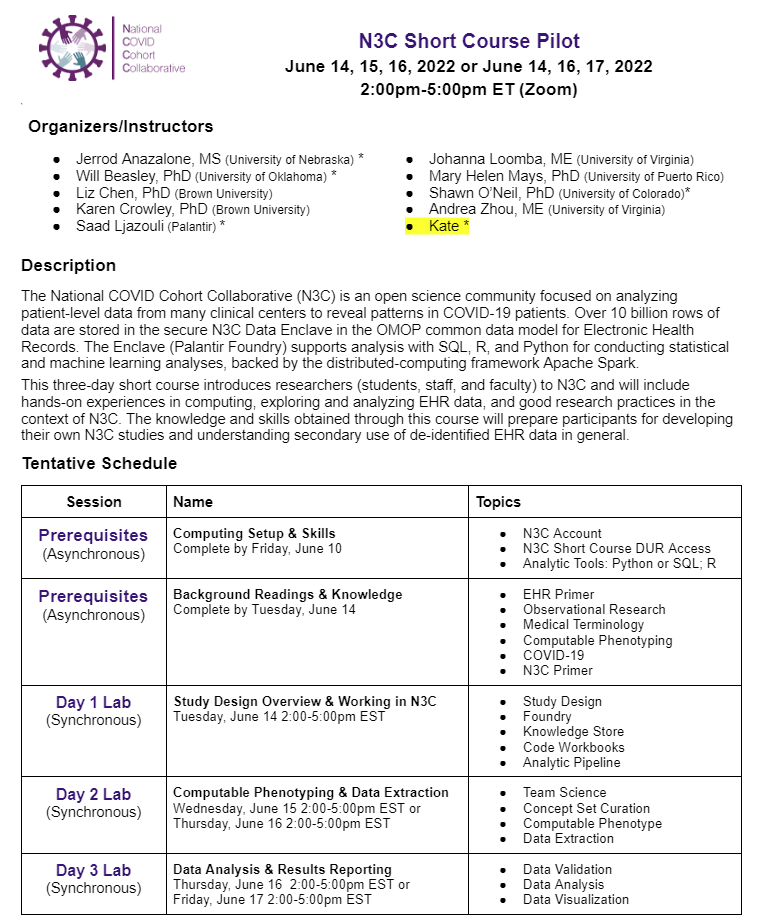

N3C Short Course, June 2022
========================

Educational material for the N3C short course, June 2022.  (All assignments are contained in the secure Enclave.)

Material Online
--------------------------

### Background

* [Analytical Tools](background/analytical-tools.md): To be productive in the N3C Enclave during this short course, we recommend that you (a) are comfortable with basic SQL and (b) know at least a little Python or R.

### Daily Sessions

#### Session 1

#### Session 2

#### Session 3

* [Data Validation](lessons/session-3/data-validation/README.md)
* [Data Visualization](lessons/session-3/data-visualization/README.md)

Assets
--------------------------

* [Google Drive directory](https://drive.google.com/drive/u/0/folders/1Que747jAtDGCR4dTQSjQZwXTirayQnwJ)

Tentative Agenda
--------------------------

