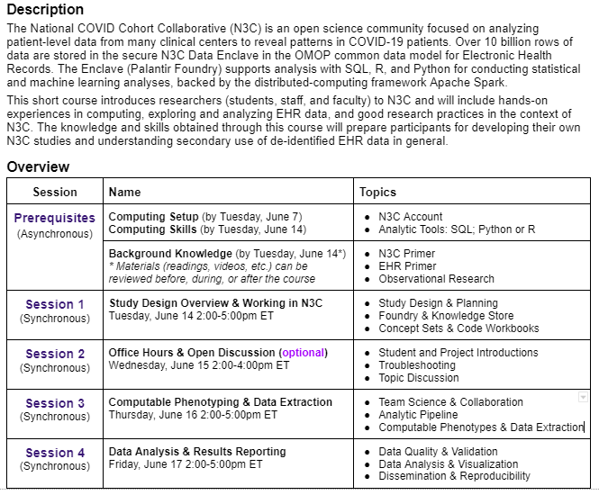

N3C Short Course, June 2022
========================

Educational material for the N3C short course, June 2022.  (All assignments are contained in the secure Enclave.)

Material Online
--------------------------

### Background

* [Protecting N3C Data](background/fear-of-god.md): an important list of rules to follow to protect patient data.  In short, keep everything in the Enclave and use the data only for projects that are specifically approved.  Please read this carefully.

* [Analytical Tools](background/analytical-tools.md): To be productive in the N3C Enclave during this short course, we recommend that you (a) are comfortable with basic SQL and (b) know at least a little Python or R.

* [Assets](background/assets.md): A running list of the links that that might be helpful references in the future.

* [Syllabus](background/../resources/n3c_short_course_syllabus_jun2022.pdf)

### Daily Sessions

#### Session 1

* [Study Design & Project Planning](https://github.com/National-COVID-Cohort-Collaborative/short-course-2022-june/blob/main/lessons/session-1/n3c-short-course-lab-notebook.pdf) Or: How N3C Researchers (Try to) Organize Their Work, by [Harold Lehmann](https://malonecenter.jhu.edu/people/harold-p-lehmann/).
* [Navigating Foundry](https://github.com/National-COVID-Cohort-Collaborative/short-course-2022-june/blob/main/lessons/session-1/Navigating%20Foundry%201.0.pdf) by [Shawn O'Neil](https://tislab.org/members/shawn-oneil.html)
* [Concept Set Curation](https://github.com/National-COVID-Cohort-Collaborative/short-course-2022-june/blob/main/lessons/session-1/Concept%20Set%20Curation%201.0.pdf) by [Shawn O'Neil](https://tislab.org/members/shawn-oneil.html)
* [Intro to Code Workbook Training Module](https://unite.nih.gov/workspace/module/view/latest/ri.workshop.main.module.e7b83a8c-545e-49ac-8714-f34bfa7f7767?view=focus&Id=22) by [Shawn O'Neil](https://tislab.org/members/shawn-oneil.html)
  * This 31 minute training module video, available in the N3C Training Portal, covers everything we covered in class today, and more. 

#### Session 2

#### Session 3

#### Session 4

* [Data Validation](lessons/session-4/data-validation/README.md) by [Will Beasley](https://ouhsc.edu/bbmc/team/#willbeasley)
* [Data Visualization](lessons/session-4/data-visualization/README.md) by [Will Beasley](https://ouhsc.edu/bbmc/team/#willbeasley)

Assets
--------------------------

* [Google Drive directory](https://drive.google.com/drive/u/0/folders/1Que747jAtDGCR4dTQSjQZwXTirayQnwJ)

Tentative Agenda
--------------------------

